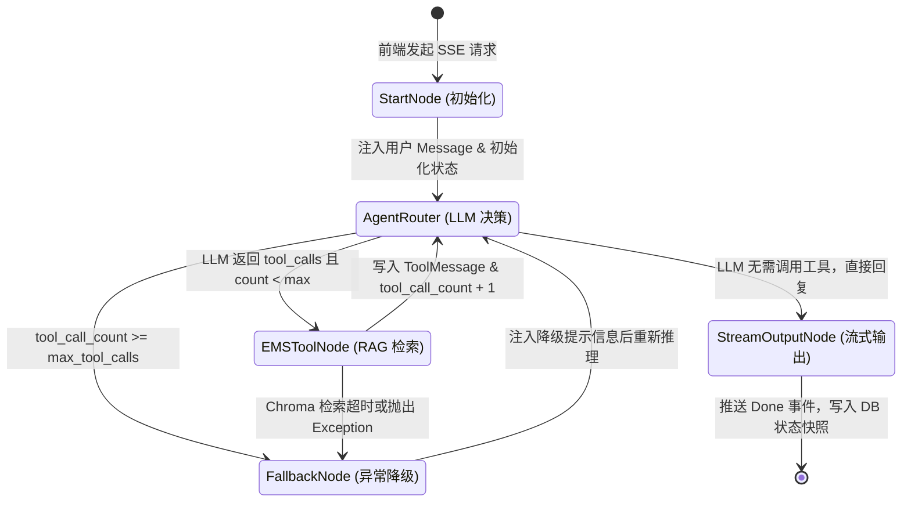

以下是为您定制的 Agent 状态流转设计文档。

---

# Agent 状态流转设计文档

## 1. 概述与设计原则

在基于 LangGraph 构建的 AI Agent 架构中，系统的执行流程由状态机（State Machine）驱动。系统在接收到用户输入后，会将对话上下文、工具调用结果以及路由控制标记封装到一个统一的状态对象（`AgentState`）中，并通过图节点（Nodes）和有向边（Edges）完成状态的变更与流转。

### 1.1 设计目标

* **显式状态管理**：将 LLM 决策、Tool 调用、异常处理与流式输出等过程显式抽象为状态转移，避免隐式隐患。
* **死循环防护**：设置最大工具调用次数与重试阈值，确保系统在工具失效或模型幻觉时能够优雅降级。
* **状态可追溯**：每个状态变更节点均触发状态快照持久化，并同步上报至 Langfuse 追踪平台。

---

## 2. Agent 状态模型定义 (State Schema)

系统使用 Python 的 `TypedDict` 定义 LangGraph 全局状态结构 `AgentState`。该状态对象在图的所有节点间共享并由节点函数进行增量更新。

### 2.1 State 字段规格

| 字段标识 | 数据类型 | 变更更新策略 | 详细说明 |
| --- | --- | --- | --- |
| `messages` | `List[BaseMessage]` | `operator.add` (追加) | 存储完整的对话历史（包含 HumanMessage, AIMessage, ToolMessage） |
| `session_id` | `str` | 覆盖更新 | 当前多轮对话的会话唯一标识 UUID |
| `user_id` | `int` | 覆盖更新 | 当前登录用户的 ID |
| `current_query` | `str` | 覆盖更新 | 用户当前轮次输入的原始问题文本 |
| `tool_call_count` | `int` | 增量替换 | 记录当前轮次已执行 `ems_handbook_tool` 的次数（初始为 0） |
| `max_tool_calls` | `int` | 常量 (只读) | 当前轮次允许调用工具的最大上限（默认设为 3 次） |
| `retrieved_context` | `Optional[str]` | 覆盖更新 | `ems_handbook_tool` 从 Chroma 检索并格式化后的参考文本 |
| `error_flag` | `bool` | 覆盖更新 | 系统是否存在未拦截异常（默认为 `False`） |
| `is_finished` | `bool` | 覆盖更新 | 当前轮次交互是否完成并可以向前端发送结束信号 |

### 2.2 Python 代码定义

```python
from typing import TypedDict, Annotated, Sequence, Optional
from langchain_core.messages import BaseMessage
import operator

class AgentState(TypedDict):
    """
    LangGraph Agent 全局状态模型
    数据在各个节点之间流动，并通过指定的 operator 进行更新
    """
    # 对话消息历史列表，采用 operator.add 进行追加合并
    messages: Annotated[Sequence[BaseMessage], operator.add]
    
    # 会话元数据
    session_id: str
    user_id: int
    current_query: str
    
    # 状态机控制与计数器
    tool_call_count: int
    max_tool_calls: int
    
    # RAG 检索结果缓存
    retrieved_context: Optional[str]
    
    # 异常与状态标识
    error_flag: bool
    is_finished: bool

```

---

## 3. LangGraph 节点与边逻辑设计

### 3.1 核心节点功能定义 (Nodes)

1. **`start_node` (状态初始化节点)**
* **职责**：接收前端请求参数，校验 Session 状态，加载历史消息，将当前用户问题包装为 `HumanMessage` 存入 `messages`，初始化 `tool_call_count = 0`。


2. **`agent_router_node` (Agent 决策节点)**
* **职责**：调用 LLM 评估当前 `messages` 与上下文。判定是否需要调用 `ems_handbook_tool` 检索知识库，或直接生成最终回答。


3. **`ems_handbook_tool_node` (RAG 工具执行节点)**
* **职责**：执行 LlamaIndex 检索逻辑，查询 Chroma 向量库。将提取到的文档 Chunk 转化为 `ToolMessage`，更新 `retrieved_context` 并使 `tool_call_count += 1`。


4. **`fallback_node` (降级处理节点)**
* **职责**：当工具执行失败、达到最大调用次数限制或检索超时时触发。向 `messages` 追加系统告警上下文，引导 LLM 在无知识库支持下直接回答或提示用户。


5. **`stream_output_node` (流式响应与持久化节点)**
* **职责**：将 LLM 生成的最终回复通过 FastAPI SSE 压入网络流，并将更新后的完整状态写入 PostgreSQL 数据库，同时完成 Langfuse Trace 结账。


### 3.2 动态条件边逻辑 (Conditional Edges)

决策函数 `should_continue(state: AgentState) -> str` 用于控制节点分流：

```python
def should_continue(state: AgentState) -> str:
    """
    判断 Agent 下一步流转方向的条件边函数
    """
    messages = state["messages"]
    last_message = messages[-1]
    tool_call_count = state.get("tool_call_count", 0)
    max_tool_calls = state.get("max_tool_calls", 3)

    # 1. 如果模型输出了 tool_calls 参数，且未达到最大调用限制
    if hasattr(last_message, "tool_calls") and last_message.tool_calls:
        if tool_call_count < max_tool_calls:
            return "call_ems_tool"
        else:
            # 超过最大限制，强制转入降级节点
            return "trigger_fallback"

    # 2. 如果存在未捕获的错误，转入降级节点
    if state.get("error_flag", False):
        return "trigger_fallback"

    # 3. 正常结束生成，进入流式输出与结束节点
    return "finish"

```

---

## 4. 状态流转拓扑图



---

## 5. 状态转移矩阵 (State Transition Matrix)

| 当前状态 (From State) | 触发条件 / 事件 (Event/Condition) | 目标状态 (To State) | 状态变更动作 (State Mutation / Action) |
| --- | --- | --- | --- |
| `IDLE` | 前端发送对话请求 | `StartNode` | 创建 `session_id`，将 Query 写入 `messages` |
| `StartNode` | 状态初始化完成 | `AgentRouter` | 无额外变更，透传状态 |
| `AgentRouter` | LLM 返回 `tool_calls` 且 `count < 3` | `EMSToolNode` | 准备 `ems_handbook_tool` 的入参 |
| `AgentRouter` | LLM 未返回 `tool_calls` | `StreamOutputNode` | 将最终回答写入 `AIMessage` |
| `AgentRouter` | `count >= 3` | `FallbackNode` | 设置 `error_flag = True`，写入超限提示语 |
| `EMSToolNode` | 向量数据库检索成功 | `AgentRouter` | 追加 `ToolMessage`，`retrieved_context` 赋值，`count += 1` |
| `EMSToolNode` | 向量库连接异常或超时 | `FallbackNode` | 追加异常日志，`retrieved_context = None` |
| `FallbackNode` | 降级 Prompt 注入完成 | `AgentRouter` | 追加降级指令 `SystemMessage` |
| `StreamOutputNode` | SSE 数据流传输完毕 | `COMPLETED` | 设置 `is_finished = True`，持久化 Checkpoint |

---

## 6. 状态守卫与死循环防护策略 (Guardrails)

为保证系统的稳定运行，避免 Agent 在多轮调用工具时陷入死循环，必须实施以下守卫策略：

1. **硬性调用计数阀门 (Hard Call Count Limit)**
* 系统严格限制单次用户请求引发的 `ems_handbook_tool` 调用不可超过 `3` 次。
* 一旦计数触发 threshold，`should_continue` 条件边将剥夺 LLM 的工具调用权，强制注入指令要求模型根据现有上下文回答。


2. **重复 Query 过滤机制**
* 在 `EMSToolNode` 执行前，比对当前 `query` 与历史 `ToolMessage` 的入参。如果检测到完全相同的检索语句，直接中止重复检索并使用缓存结果。


3. **单节点超时控制**
* 单个 `EMSToolNode` 执行限定超时时间为 5 秒。超时自动切断并返回空检索结果，防止整个 SSE 连接被长时间挂起。


---

## 7. 状态持久化与 Langfuse 观测绑定

### 7.1 PostgreSQL Checkpointer 状态持久化

系统采用 LangGraph 的 `AsyncPostgresSaver` 机制。每个节点运行完成后，状态快照将被自动加密并写入 PostgreSQL 数据库的 `checkpoints` 表中。

```python
# 状态持久化配置示例 (用于断点续传与多轮历史加载)
thread_config = {
    "configurable": {
        "thread_id": state["session_id"],  # 以 session_id 作为线程隔离标识
        "user_id": state["user_id"]
    }
}

```

### 7.2 Langfuse Trace 状态绑定

在状态转移过程中，Langfuse 句柄（`LangfuseHandler`）作为 Callback 挂载到每一个 Node 中：

* **`AgentRouter` 转移时**：上报 Prompt Token 消耗及 Model 决策耗时。
* **`EMSToolNode` 转移时**：上报向量检索的 Similarity Score（相似度得分）与检索 Hit 数量。
* **`StreamOutputNode` 转移时**：上报首字延迟（TTFT, Time To First Token）与总响应生成耗时。