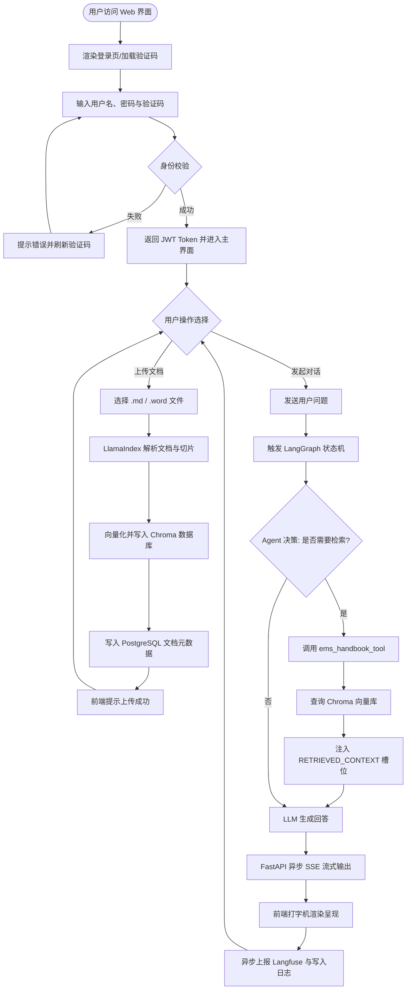
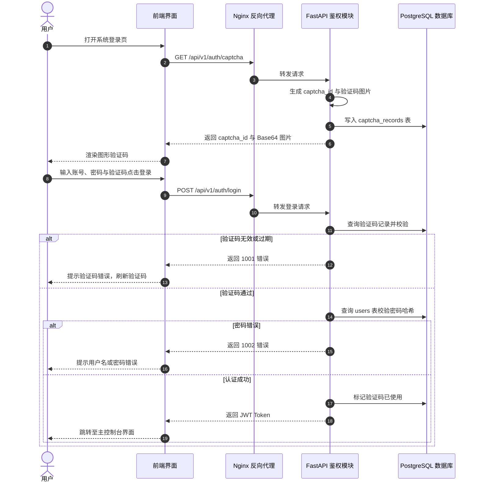
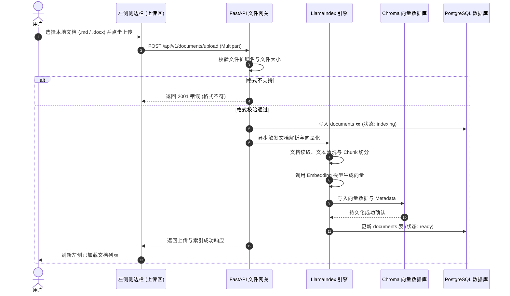
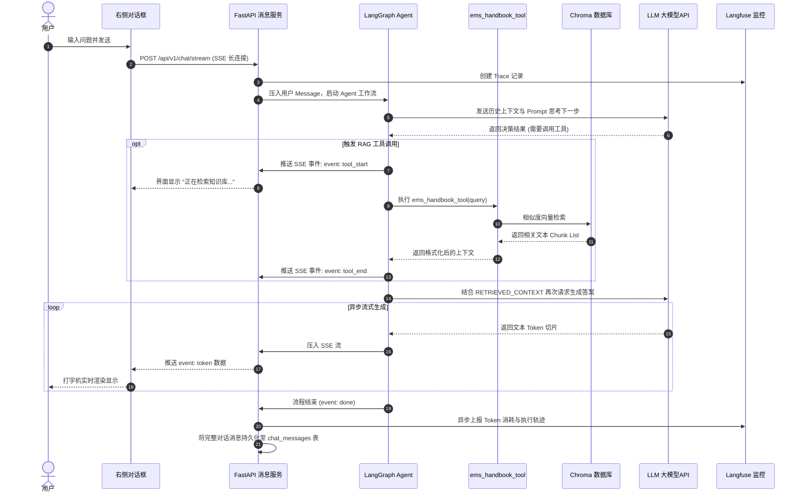

以下是为您定制的业务流程图设计文档。

---

# 业务流程图设计文档：基于 AI Agent 的多轮对话系统

## 1. 概述

本文档旨在梳理“基于 AI Agent 的多轮对话系统”的主要业务流程。系统覆盖用户身份鉴权、文档管理与 RAG 索引构建、基于 LangGraph 的异步流式 Agent 问答，以及运维监控日志记录四大核心子流程。

文档采用标准 Mermaid 流程图进行展示，方便开发团队快速理解各模块之间的业务依赖与数据流转。

---

## 2. 系统全景业务流程图

---

## 3. 核心子业务流程图

### 3.1 身份认证与图形验证码流程

---

## 3.2 文档上传与 RAG 索引构建流程

---

## 3.3 异步流式多轮对话与 Tool 执行流程

---

## 4. 业务角色与系统交互矩阵 (泳道图说明)

| 业务环节 | 客户端/用户 (Frontend) | 接入网关 (Nginx) | 后端服务 (FastAPI / LangGraph) | 数据与监控 (Chroma / DB / Langfuse) |
| --- | --- | --- | --- | --- |
| **鉴权准备** | 请求图形验证码 | SSL 加密解密与反向代理 | 生成图形验证码并暂存 | 将验证码及过期时间存入 `captcha_records` 表 |
| **登录校验** | 提交用户名、密码、验证码 | 转发 HTTP POST 请求 | 校验验证码，比对数据库密码哈希 | 查验 `users` 表，校验成功后发放 Token |
| **知识库维护** | 上传 `.md` / `.word` 文件 | 转发文件流 | 调用 LlamaIndex 切分并生成向量 | 向量存入 Chroma，元数据存入 `documents` 表 |
| **Agent 对话** | 发起流式对话，实时接收 SSE | 维持长连接 (关闭 Buffer) | 运行 LangGraph 状态机，决策并调用 Tool | 检索向量知识库，记录日志与 Langfuse Trace |